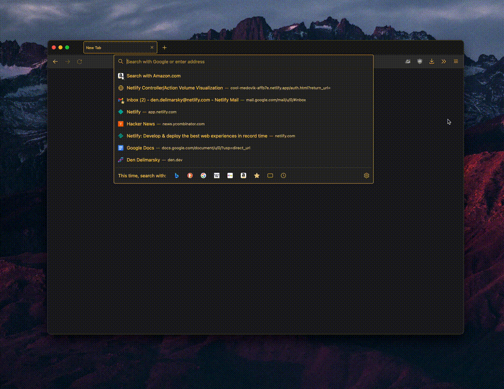
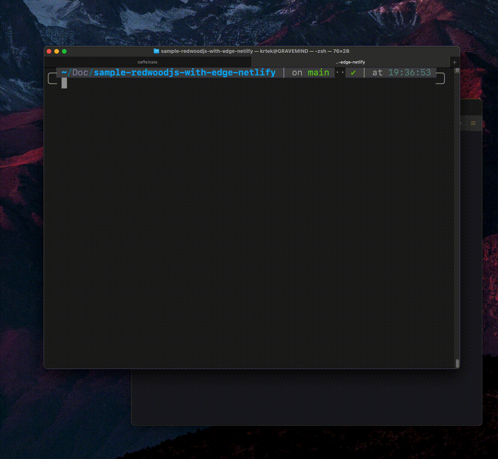

# Using Netlify Edge Functions with RedwoodJS

A starter example that shows how to use [RedwoodJS](https://redwoodjs.com/) with [Netlify Edge Functions](https://docs.netlify.com/netlify-labs/experimental-features/edge-functions/).

[](https://app.netlify.com/start/deploy?repository=https://github.com/ericapisani/sample-redwoodjs-with-edge-netlify)

The example shows how geolocation through the Netlify Edge Functions can be used to determine what page needs to be rendered for each region. For example, if you are from the US, you might get some hints as to what is football and what is not.

## Demo site

Visit https://redwood-with-edge-demo.netlify.app/ to see the code in this repository in action.



## Prerequisites

- RedwoodJS requires [Node.js](https://nodejs.org/en/) (>=14.19.x <=16.x) and [Yarn](https://yarnpkg.com/) (>=1.15) installed.
- Using Netlify Edge Functions locally requires the [Netlify CLI](https://www.npmjs.com/package/netlify-cli) installed.

## Local development

To get stated with local development, follow the instructions below in your terminal application:

1. Clone this repository locally:
    ```bash
    git clone https://github.com/ericapisani/sample-redwoodjs-with-edge-netlify
    ```

2. Navigate to the repository folder:
    ```bash
    cd sample-redwoodjs-with-edge-netlify
    ```

3. Install the package dependencies:
    ```bash
    yarn install
    ```

4. Start the application using the Netlify CLI (this will ensure that the Edge Function is executed as well):
    ```bash
    netlify dev
    ```

If the command is successful, you should see a new browser window open with the application running locally.



## Questions and troubleshooting

If you found an issue with the code in this repository, feel free to [open an issue](https://github.com/ericapisani/sample-redwoodjs-with-edge-netlify/issues) or let us know in the [Netlify Forums](https://answers.netlify.com/).